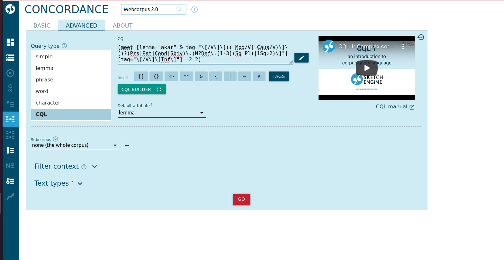

# A (pre)modális szemantikai térrel összekapcsolódó főnévi igeneves szerkezetek vizsgálata

A jelen kutatás a segédige + főnévi igeneves szerkezetek megvalósulási környezeteit hivatott elemezni korpuszalapon,
 számítógépes vizsgálati eljárásokkal. Az adatokból látható mintázat-együttállásokból elméleti hipotézisek
 felállításával kapcsolódik ahhoz a kutatási kérdéshez, hogy a vizsgált premodális ([lehetségességi relációt]()
 nem explikáló) jelentéssel asszociálódó főnévi igeneves kompozitumszerkezetek milyen nyelvi, konstrukcionális
 kidolgozottságban képesek átlépni a jelentésképzés során a modális szemantikai térbe. A mintavételezés
 az [Magyar Nemzeti Szövegtár 2.0.5-ből (MNSZ2)](http://clara.nytud.hu/mnsz2-dev/)
 ([Oravecz–Váradi–Sass 2014](https://aclanthology.org/L14-1536/))
 és a [Magyar Webkorpusz 2.0-ból](https://hlt.bme.hu/hu/resources/webcorpus2)
 ([Nemeskey 2020](https://hlt.bme.hu/hu/publ/nemeskey_2020)) valósult meg két lépcsőben.
 Az első mintavétel során egy reprezentatív (a korpusz méretéhez viszonyítva kis) elemszámú csoportot vételeztem,
 a másodiknál pedig törekedtem a keresési kondíciók által kiadott összes elem mentésére (a rendszer képességeinek
 határáig). A korpuszok által felkínált részletes keresési metódusok nagyon vonzónak tűntek, azonban a legprecízebb
 mintavételezéshez a [CQL kifejezésekkel](https://www.sketchengine.eu/documentation/corpus-querying/) történő szűrést
 választottam.

## Minták a korpuszokból

### Minta az MNSZ2-ből (v2.0.5)

1. ***tud*** + inf. (a minta mérete: 500) / ***tud*** + inf. (a minta mérete: 675000) | teljes minta: 1315296
2. ***akar*** + inf. (a minta mérete: 384) / ***akar*** + inf. (a minta mérete: 610836) | teljes minta: 610836
3. ***szeret*** + inf. (a minta mérete: 384) / ***szeret*** + inf. (a minta mérete: 484448) | teljes minta: 484448
4. ***kíván*** + inf. (a minta mérete: 384) / ***kíván*** + inf. (a minta mérete: 192678) | teljes minta: 192678
5. ***képes*** + inf. (a minta mérete: 384) / ***képes*** + inf. (a minta mérete: 134843) | teljes minta: 134843
6. ***-kOzik|-kOdik*** + inf. (a minta mérete: 382) / ***-kOzik|-kOdik*** + inf. (a minta mérete: 255799) | teljes minta: 255799
7. ***mer*** + inf. (a minta mérete: 382) / ***mer*** + inf. (a minta mérete: 63729) | teljes minta: 63729
8. ***képtelen*** + inf. (a minta mérete: 381) / ***képtelen*** + inf. (a minta mérete: 48036) | teljes minta: 48036
9. ***hajlandó*** + inf. (a minta mérete: 381) / ***hajlandó*** + inf. (a minta mérete: 48267) | teljes minta: 48267
10. ***bír*** + inf. (a minta mérete: 379) / ***bír*** + inf. (a minta mérete: 22191) | teljes minta: 22191
11. ***remél*** + inf. (a minta mérete: 364) / ***remél*** + inf. (a minta mérete: 6506) | teljes minta: 6506
12. ***óhajt*** + inf. (a minta mérete: 361) / ***óhajt*** + inf. (a minta mérete: 5500) | teljes minta: 5500
13. ***hajlamos*** + inf. (a minta mérete: 357) / ***hajlamos*** + inf. (a minta mérete: 4212) | teljes minta: 4212
14. ***vágyik*** + inf. (a minta mérete: 313) / ***vágyik*** + inf. (a minta mérete: 1658) | teljes minta: 1658
14. ***utál*** + inf. (a minta mérete: 306) / ***utál*** + inf. (a minta mérete: 1448) | teljes minta: 1448
15. ***gyűlöl*** + inf. (a minta mérete: 132) / ***gyűlöl*** + inf. (a minta mérete: 132) | teljes minta: 188

<!-- TODO Leírni, hogy miért kell két CQL! Illetve, hogy mit cisnálnak a reqkifek. -->

[Az **MNSZ2** keresőfelületén](http://clara.nytud.hu/mnsz2-dev/) az alábbi CQL-eket kellett tehát megadni, mert...

`(meet [lemma="akar" & msd="(IK\.)*IGE\.(_HAT\.)?[TI]?[MPF]?[et]?[123]?"] [msd="(IK\.)*IGE\.INF[123]?\*?"] -2 2)`

`(meet [lemma="képes" & msd="MN.PL*.NOM"] [msd="(IK\.)*IGE\.INF[123]?\*?"] -2 2)`

### Minta a Magyar Webkorpusz 2.0-ból

1. ***tud*** + inf. (a minta mérete: 500) / ***tud*** + inf. (a minta mérete: 650000) | teljes minta: 10000000
2. ***szeret*** + inf. (a minta mérete: 500) / ***szeret*** + inf. (a minta mérete: 650000) | teljes minta: 4335004
3. ***akar*** + inf. (a minta mérete: 500) / ***akar*** + inf. (a minta mérete: 650000) | teljes minta: 4221889
4. ***képes*** + inf. (a minta mérete: 500) / ***képes*** + inf. (a minta mérete: 650000) | teljes minta: 1408225
5. ***kíván*** + inf. (a minta mérete: 500) / ***kíván*** + inf. (a minta mérete: 650000) | teljes minta: 938075
6. ***mer*** + inf. (a minta mérete: 384) / ***mer*** + inf. (a minta mérete: 473966) | teljes minta: 473966
7. ***-kOzik|-kOdik*** + inf. (a minta mérete: 384) / ***-kOzik|-kOdik*** + inf. (a minta mérete: 255799) | teljes minta: 255799
8. ***hajlandó*** + inf. (a minta mérete: 384) / ***hajlandó*** + inf. (a minta mérete: 272806) | teljes minta: 272806
9. ***bír*** + inf. (sample size: 384) / ***bír*** + inf. (a minta mérete: 179846) | teljes minta: 179846
10. ***képtelen*** + inf. (a minta mérete: 384) / ***képtelen*** + inf. (a minta mérete: 164909) | teljes minta: 164909
11. ***hajlamos*** + inf. (a minta mérete: 382) / ***hajlamos*** + inf. (a minta mérete: 63343) | teljes minta: 63343
12. ***remél*** + inf. (a minta mérete: 382) / ***remél*** + inf. (a minta mérete: 55246) | teljes minta: 55246
13. ***óhajt*** + inf. (a minta mérete: 379) / ***óhajt*** + inf. (a minta mérete: 21225) | teljes minta: 21225
14. ***utál*** + inf. (a minta mérete: 379) / ***utál*** + inf. (a minta mérete: 16652) | teljes minta: 16652
15. ***gyűlöl*** + inf. (a minta mérete: 310) / ***gyűlöl*** + inf. (a minta mérete: 2492) | teljes minta: 2492
16. ***vágyik*** + inf. (a minta mérete: 379) / ***vágyik*** + inf. (a minta mérete: 1658) | teljes minta: 1658

<!-- TODO Leírni, hogy miért kell két CQL! Illetve, hogy mit cisnálnak a reqkifek. -->

[Az **Magyar Webkorpusz 2.0** keresőfelületén](https://sketchengine.elte-dh.hu/) az alábbi CQL-eket kellett tehát
 megadni, mert...

`(meet [lemma="akar" & tag="\[/V\]\[((_Mod/V|_Caus/V)\]\[)?(Prs|Pst|Cond|Sbjv)\.(N?Def\.[1-3](Sg|Pl)|1Sg›2)\]"] [tag="\[/V\]\[Inf\]"] -2 2)`

`(meet [lemma="képes" & tag="\[/Adj\]\[Nom\]|\[/Adj\]\[Pl\]\[Nom\]"] [tag="\[/V\]\[Inf\]"] -2 2)`

## Útmutató a korpuszokból való mintavételhez

### Minta az MNSZ2-ből

<!-- TODO A CQL leírása menjen feljebb! -->
1. Az első lépésben az [MNSZ2 felületén](http://clara.nytud.hu/mnsz2-dev/) állítsuk át a lekérdezés típusát a **CQL**-re
    a legördülő menüből. Ide tudjuk beilleszteni a számunkra megfelelő CQL-t. A jelen dokumentációban 
    a Magyar Nemzeti Szövegtár felületén a segédigék és segédmelléknevek elérése olyan CQL-t kínálunk, amellyel -2 +2 (a nódusztól/kwictől jobbra és balra 2–2 pozícióban) ablakban tudjuk lekérni a segédigés komponenst a főnévi igenévhez viszonyítva. Természetesen ezt az ablakot opcionálisan tudjuk állítani, ehhez írjuk át a CQL kód végén szereplő számokat). 


2. Ha lefuttattuk a keresést, akkor a bal menüsávban kattintsunk a **KWIC/mondat** ikonra. Ez a funkció a találatainkat pontosan egy mondatból álló kontextusban fogja megjeleníteni. 


3. Ezután célszerű ellenőrizni a megjelenítési beállításokat. Ezt a **Megjelenítés** menüpontra kattintva tudjuk megtenni.  
   A beállításoknál a következőkre figyeljünk: 1. **attribútumok --> word**, 2. **struktúrák --> doc**, 3. **infó --> dokumentumazonosító** opciók legyenek kijelölve/bepipálva.


4. Ha a fenti pontokban leírt instrukciókat végrehajtottuk, akkor lépjünk vissza a konkordanciára. A baloldalon látható menüből válasszuk a **Véletlen minta** ikont. Itt megadhatjuk azt, hogy a konkordanciánkból hány elemű mintát szeretnénk vételezni. **Ha a teljes konkordanciával szeretnénk dolgozni, akkor ezt a lépést hagyjuk ki.**


5. Navigáljunk vissza a konkordanciára, majd válasszuk ki a menüből a **Konkordancia mentése** opciót. A formátumot
   állítsuk át **XML**-re. Ha a konkordanciánk több, mint 1000 elemet tartalmaz, akkor állítsuk át a sorok számát
   a kívánt mennyiségre a minta maximális méretéhez igazodva. A letöltés hosszú időt vehet igénybe, valamint 
   a kapott XML fájlok kódolása a deklarációjukkal ellentétben UTF-8 lesz. Ez a hiba az ékezeteknél problémát
   okozhat (lásd lent).


### Minta a Magyar Webkorpusz 2.0-ból

1. Hasonlóan az [MNSZ2-ből végzett mintavételezéshez](#minta-az-mnsz2-bol), legelőször itt is a keresési céljainkhoz megfelelő paramétereket állítsuk be a lekérdező felületen. A **Query type** listában válasszuk ki a **CQL**-t. Illesszük be az általunk preferált CQL kifejezést a mezőbe. Ahogyan az MNSZ2 esetében, itt is tudjuk állítani a keresési ablakot azzal, ha a -2 2 értékeket megváltoztatjuk a CQL kifejezésben.



2. A keresés lefuttatása után ellenőrizzük a felső menüsávban a megjelenítést. A soronként pontosan egy mondat megjelenítéshez válasszuk ki a **sentence** opciót. 


3. A következő lépésben válasszuk ki a **View options**-t (szem ikon). Itt az alábbi beállítások lesznek fontosak: 1. **words** és a **For KWIC Only** opciók kiválasztása, 2. **Use glue** kikapcsolása. 


4. A **Get a random sample** (kérdőjeles dobókocka ikon) kiválasztásával tudjuk beállítani a mintavétel méretét (ha a lekérdezés teljes eredményével szeretnénk dolgozni, akkor ezt a lépést hagyjuk ki). 


5. Végül kattintsunk a **Download**-ra (lefelé mutató nyíl). Kattintsunk az **XML** gombra. 


## Útmutató a TSV (TAB Separated Values) formátum előállításához és az egységes nyelvi előfeldolgozáshoz

Az [e-magyar nyelvi elemzőrendszert (emtsv)](https://github.com/nytud/emtsv) ([Indig et al.]()) használjuk a minták egységes előfeldolgozásához.

A repoziróium klónozása után a terminálból tudjuk futtatni az alábbi programokat a megfelelő paraméterek megadásával.
 A bemenet lehet egyetlen egy fájl, de akár egy egész mappa is, tehát, ha több fájlt szeretnénk feldolgoztatni,
 akkor nem muszáj egyesével elvégeznünk ezt a műveletet, hanem azonos mappába rendezve őket, 
 -- a mappát paraméterként megadva, -- egy lépésben elvégezhető a művelet rajtuk.
 A terminálban a `cd` paranccsal tudunk a könyvtárak szerkezetén belül navigálni, valamint az `ls` paranncsal tudjuk
 lekérdezni azt, hogy az adott mappán belül milyen fájlok találhatóak. 
<!-- TODO A virtualenv létrehozása !!! -->

Az `-i` az input fájlt/mappát jelöli, itt adjuk meg annak 
   a fájlnak/mappának az elérési útvonalát, amelyet szeretnénk átalakítani. Az `-o` az output fájlt/mappát kéri, olyan 
   útvonalat és mappa/fájl nevet adjunk meg, amely még nem létezik a gépünkön. A `-p` azt jelenti, hogy hány szálon fusson a program a futtatáskor.

`-i`: az input fájlt/mappát jelöli, itt adjuk meg annak a fájlnak/mappának az elérési útvonalát, amelyet szeretnénk átalakítani. Az `-o` az output fájlt/mappát kéri, olyan útvonalat és mappa/fájl nevet adjunk meg, amely még nem létezik a gépünkön. Ha kívánjuk állítani azon, hogy hány szálon fusson a program akkor a `-p` argumentum megadásával ezt meg tudjuk tenni. 

<!-- Itt írjuk le, hogy a TSV formátum hogy néz ki pontosan, header, meta, szavak, elemzés ha van, stb. -->

### A feldolgozás lépései

1. Ahhoz, hogy az emtsv képes legyen feldolgozni a korpuszokból kinyert adatainkat, TSV formátummá kell alakítanunk
   a [NoSketch Engine korpuszlekérdezőből](https://nlp.fi.muni.cz/trac/noske) kapott XML fájlokat. Ehhez ebben
   a repozitóriumban megtalálható [`xml_to_emtsv.py`](xml_to_emtsv.py) nevű programot fogjuk használni. Nyissuk meg
   a terminált, navigáljunk a klónozott könyvtárba.

 

2. A Python megnyitásához írjuk be, először, hogy `./venv/bin/python` utána írjuk be a program nevét: 
   [`xml_to_emtsv.py`](xml_to_emtsv.py).
   Ezután adjuk meg a bemeneti és kimeneti adatokra vonatkozó paramétereket (lásd fent).  Az `-f` és a `-t`
   argumentumok abban az esetben szükségesek, amikor a karakterkódolás deklarációja az egyes XML dokumentumokban
   nem felel meg az adott fájl tényleges kódolásának (az MNSZ2-ből vett minta esetén). Ekkor Az `-f latin-2` és
   `-t UTF-8` paraméterekkel érhető el a kívánt kódolás.

```commandline
$ ./venv/bin/python xml_to_emtsv.py -i mnsz2_xml -o mnsz2_tsv -f latin-2 -t UTF-8
$ ./venv/bin/python xml_to_emtsv.py -i webkorpusz_xml -o webkorpusz_tsv
```


3. Ha megnyitjuk a kimeneti tsv fájlt a számítógépünkön (táblázatkezelő szoftverben pl.), akkor látjuk, hogy az adatok előtt a metaadatokat is megtaláljuk.

## Útmutató az emtsv használatához

1. A következőkben az emtsvt fogjuk futtatni a TSV formátummá alakított mintáinkon. Az előzőekhez hasonlóan a parancssorban dolgozunk.


<!-- TODO code fence-ben írd le a képet -->

2. A Python megnyitásához írjuk be, először, hogy `./venv/bin/python` utána írjuk be a program nevét:
   [`emtsv2.py`](emtsv2.py). Ezután a feldolgozáshoz szükséges argumentumok a következők:
    - `-s`: az e-magyar szerverének elérési útvonala (pl. `http://emtsv.elte-dh.hu:5000`)
    - `-m`: a használandó modulok nevei (a használható modulok listájához lásd
       a [dokumentációt](https://github.com/nytud/emtsv#modules)) vesszővel elválasztva (pl. `tok,morph,pos` )
    - `-k`: azokat a mezőneveket adhatjuk meg, amelyeket a kimeneti fájlban meg kívánunk tartani (pl. `form,lemma,xpostag`)
    - `-i` és `-o`: a bemenet és kimenet meghatározására (lásd fent)
    - `-r` (opcinális): megadja, hogy a parancs hányszor próbálkozzon újra az emtsv lekérdezéssel sikertelenség esetén

```commandline
$ ./venv/bin/python xml_to_emtsv.py -i mnsz2_xml -o mnsz2_tsv -f latin-2 -t UTF-8
$ ./venv/bin/python xml_to_emtsv.py -i webkorpusz_xml -o webkorpusz_tsv
```


## Források és hivatkozások
- Indig Balázs – Sass Bálint – Simon Eszter –  Mittelholcz Iván –  Kundráth Péter –  Vadász Noémi 2019. emtsv – egy formátum mind felett. In: *XV. Magyar Számítógépes Nyelvészeti Konferencia.* Szegedi Tudományegyetem TTIK, Informatikai Intézet. Szeged.  235–247. [link](http://real.mtak.hu/99685/)
- Magyar Nemzeti Szövegtár (v2.0.5); Oravecz Csaba – Váradi Tamás – Sass Bálint 2014. The Hungarian Gigaword Corpus. In: Calzolari, Nicoletta – Choukri, Khalid – Declerck, Thierry – Loftsson, Hrafn –Maegaard, Bente – Mariani, Joseph – Moreno, Asuncion – Odijk, Jan – Piperidis, Stelios (eds.): *Proceedings of the ninth international conference on language resources and evaluation (LREC-2014)*. Reykjavik: European Languages Resources Association (ELRA). 1719–1723. [link](http://real.mtak.hu/20143/)
- Webkorpus 2.0; Nemeskey Dávid Márk 2020. *Natural Language Processing methods for Language Modeling*. PhD thesis. Eötvös Loránd University. [link](https://hlt.bme.hu/media/pdf/nemeskey_thesis.pdf)

