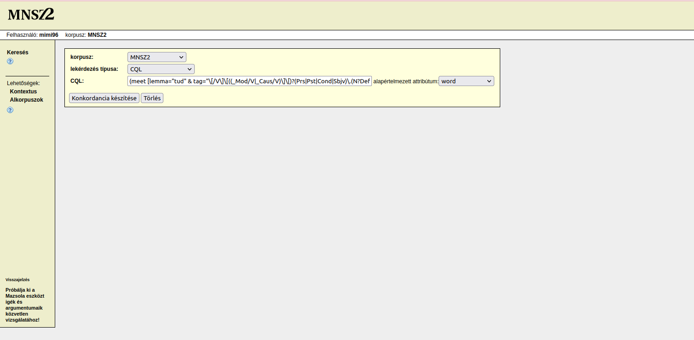

# A (pre)modális szemantikai térrel összekapcsolódó főnévi igeneves szerkezetek vizsgálata

 A jelen kutatás a segédige + főnévi igeneves szerkezetek megvalósulási környezeteit hivatott elemezni korpuszalapon,
 számítógépes vizsgálati eljárásokkal. Az adatokból látható mintázat-együttállásokból elméleti hipotézisek
 felállításával kapcsolódik ahhoz a kutatási kérdéshez, hogy a vizsgált premodális
 ([lehetségességi relációt](https://www.researchgate.net/publication/249926985_From_premodal_to_modal_meaning_Adjectival_pathways_in_English)
 nem explikáló) jelentéssel asszociálódó főnévi igeneves kompozitumszerkezetek milyen nyelvi, konstrukcionális
 kidolgozottságban képesek átlépni a jelentésképzés során a modális szemantikai térbe. A mintavételezés
 a [Magyar Nemzeti Szövegtár 2.0.5-ből (MNSZ2)](http://clara.nytud.hu/mnsz2-dev/)
 ([Oravecz–Váradi–Sass 2014](https://aclanthology.org/L14-1536/))
 és a [Magyar Webkorpusz 2.0-ból](https://hlt.bme.hu/hu/resources/webcorpus2)
 ([Nemeskey 2020](https://hlt.bme.hu/hu/publ/nemeskey_2020)) történt, törekedtem a keresési kondíciók által kiadott összes elem mentésére (a rendszer képességeinek
 határáig). A korpuszok által felkínált részletes keresési metódusok nagyon vonzónak tűntek, azonban a legprecízebb
 mintavételezéshez a [CQL kifejezésekkel](https://www.sketchengine.eu/documentation/corpus-querying/) történő szűrést
 választottam.
 A jelenlegi tudásunk szerint a nyelvészeti célú konstrukcióazonosításban a legmegbízhatóbb eljárás a nagymennyiségű, tisztított, valós nyelvi adatokból álló minták   feldolgozása. [Indig (2017)](http://real.mtak.hu/73335/) a mozaik n-gram módszert az így előálló feladat megoldására hozta létre.
A nyelvi adatokat értelmezhetjük n-gramokként. Az e-magyar nyelvi elemzőrendszer moduláris kimenete alapján lehetőségünk van a tokenek (szóalakok), a lemmák (szótövek) és a POS-tagek n-gramjait létrehozni. A mozaik azt jelenti, hogy az adott szekvenciában (kolligációban, hiszen ezek egymással függőségi viszonyban lévő elemek) eltérő reprezentációs szinteken fordulhatnak elő az elemek. A különböző szintű absztrakciók egyidejű jelenléte lehetőséget teremt arra, hogy a valamiért egymással összetartozó kifejezésmódokat csoportokként kezeljük, ezzel valószínűsíthetően feltárva a forma–funkció felől a konstrukció-jelölteket. Azonban nem haszontalan a mozaikokat afelől a kérdés felől is megközelíteni, hogy milyen komponenseket tartalmaznak a bizonyos segédige, illetve segédmelléknév típusok példányaival asszociálódó megvalósulások. Ezért a szózsák-modellt (Bag of Words, BoW) is alkalmazza a kutatás azért, hogy minél több reprezentációs szinten és minél hatékonyabban kapjunk betekintést a vizsgált konstruktumok mintázatainak szerveződésébe. A “szózsákok” azokat a szimbolikus egységeket (ezek szintén mozaikok) tartalmazzák, amelyek adatolhatók a vizsgált példányban. A BoW módszer a szórendre nem érzékeny, csupán arról ad számot, hogy milyen elemek fordulnak elő egymással és hányszor.

## Minták a korpuszokból

### Minta az MNSZ2-ből (v2.0.5)
| Segédige / predikatív melléknév + főnévi igenév | A teljességre törekvő<br/> minta elemszáma (db) | Összes találat a korpuszban | Minta mérete a szűrés után |
|-------------------------------|---------|----------|---------|
| ***tud*** + inf.              | 675000  | 131529   | 466863  |
| ***akar*** + inf.             | 610836  | 610836   | 419324  |
| ***szeret*** + inf.           | 484448  | 484448   | 278834  |
| ***kíván*** + inf.            | 192678  | 192678   | 139498  |
| ***képes*** + inf.            | 134843  | 134843   |	   |
| ***-kOzik/-kOdik*** + inf.    | 255799  | 255799   |	   |
| ***mer*** + inf.              | 63729   | 63729    | 39177   |
| ***képtelen*** + inf.         | 48036   | 48036    |	   |
| ***hajlandó*** + inf.         | 48267   | 48267    |	   |
| ***bír*** + inf.              | 22191   | 22191    | 15387   |
| ***óhajt*** + inf.            | 5500    | 5500     | 4232    |
| ***imád*** + inf              | 5081    | 5081     | 2323    |  
| ***hajlamos*** + inf.         | 4212    | 4212     |	   |
| ***vágyik*** + inf.           | 1658    | 1658     |	   |
| ***utál*** + inf.             | 1448    | 1448     | 947	   |
| ***gyűlöl*** + inf.           | 132     | 132      |	   |


[Az **MNSZ2** keresőfelületén](http://clara.nytud.hu/mnsz2-dev/) az alábbi CQL-eket kellett tehát megadni:

 **(1a)** `(meet [lemma="akar" & msd="(IK\.)*IGE\.(_HAT\.)?[TI]?[MPF]?[et]?[123]?"]
 [msd="(IK\.)*IGE\.INF[123]?\*?"] -2 2)`

 **(1b)** `(meet [lemma="képes" & msd="MN.PL*.NOM"] [msd="(IK\.)*IGE\.INF[123]?\*?"] -2 2)`

 Ezek a CQL-ek (1a)–(1b) tették lehetővé a keresést a korpuszban. A segédige + főnévi igenév szerkezetre az (1a)
 kifejezést, a predikatív melléknév + főnévi igenév konstrukció szűrésére az (1b) CQL-t használtam.

 A CQL kifejezések lehetővé tették, hogy azok a példányok is elérhetővé váljanak, amelyek a részletes keresési
 beállításokkal nem voltak megtalálhatók. A CQL `lemma=" "` kifejezésrészében, az egyenlőségjel után adjuk meg
 az általunk keresett segédige, vagy melléknév szótári alakját (lemmáját). Ha a fentebb lévő reguláris kifejezésekre
 tekintünk, akkor látjuk, hogy az elsőben szerepel példaként az *akar*, míg a másodikban a *képes*. Tehát láthatjuk,
 hogy a melléknévi komponenst tartalmazó szerkezetek CQL kifejezése eltérő. Ez természetesen a kétféle szerkezet
 a formai oldalon tapasztalható egymástól való eltérése motiválta.

 A segédigés konstrukció esetében a segédigei komponenst szemlélve valamilyen (megkötés nincs) finit
 igealakot várunk (tartalmazhat *-hAt* deverbális verbum képzőt is), míg a melléknév/segédmelléknév megvalósulásai közül
 az egyes nominativusi, vagy többes nominativusi eseteket szeretnénk megkapni a főnévi igenévi komponens szomszédjában
 (pl. *Peti képes úszni*). A főnévi igenévi szerkezettagra vonatkozólag nem volt megkötésünk, ez természetesen lehet
 igekötős. Az `msd=" "` része tartalmazza a morfológiai és a szófaji annotációkat.

 A reguláris kifejezés végén látható két darab szám (-2 és 2), amelyek azt jelentik, hogy a segédige/melléknév
 környezetében mekkora keresési ablakban jelenhet meg a főnévi igenév. Ez megváltoztatható.

 ### Minta a Magyar Webkorpusz 2.0-ból
| Segédige / predikatív melléknév + főnévi igenév | A teljességre törekvő<br/> minta elemszáma (db) | Összes találat a korpuszban | Minta mérete a szűrés után |
|------------------------------|-------|----------|------------|
| ***tud*** + inf.             | 650000   | 10000000   |540175 |
| ***szeret*** + inf.          | 650000   | 4335004    |448324 |
| ***akar*** + inf.            | 650000   | 4221889    |518123 |
| ***képes*** + inf.           | 650000   | 1408225    |       |
| ***kíván*** + inf.           | 650000   | 938075     |391413 |
| ***mer*** + inf.             | 473966   | 473966     |278887 |
| ***-kOzik/-kOdik*** + inf.   | 255799   | 255799     |       |
| ***hajlandó*** + inf.        | 272806   | 272806     |       |
| ***bír*** + inf.             | 179846   | 179846     |112112 |
| ***képtelen*** + inf.        | 164909   | 164909     |       |
| ***hajlamos*** + inf.        | 63343    | 63343      |       |
| ***imád*** + inf.            | 79430    | 79430      |32997  |
| ***óhajt*** + inf.           | 21225    | 21225      |15161  |
| ***utál*** + inf.            | 16652    | 16652      |9464   |
 | ***gyűlöl*** + inf.         | 2492     | 2492       |       |
 | ***vágyik*** + inf.         | 1658     | 1658       |       |


 [Az **Magyar Webkorpusz 2.0** keresőfelületén](https://sketchengine.elte-dh.hu/) az alábbi CQL-eket kellett tehát
 megadni:

 **(2a)** `(meet [lemma="akar" & tag="\[/V\]\[((_Mod/V|_Caus/V)\]\[)?(Prs|Pst|Cond|Sbjv)\.(N?Def\.[1-3](Sg|Pl)|1Sg›2)\]"]
 [tag="\[/V\]\[Inf\]"] -2 2)`

 **(2b)** `(meet [lemma="képes" & tag="\[/Adj\]\[Nom\]|\[/Adj\]\[Pl\]\[Nom\]"] [tag="\[/V\]\[Inf\]"] -2 2)`

 A kutatás mintavételéhez alkalmazott CQL kifejezésekről bővebben lásd [fenn.](#minta-az-mnsz2-ből)
 Az eltérés az, hogy itt a CQL `tag=" "` szegmense tartalmazza a morfológiai és a szófaji annotációkat, illetve a
 szófaji és morfológiai jelenségek kódolása a formai oldalon eltér. A (2a) CQL a segédige + főnévi igenév szerkezeteket
 szűri, a (2b) pedig a predikatív melléknév + főnévi igenév előfordulásokat.

## Útmutató a korpuszokból való mintavételhez

### Minta az MNSZ2-ből

1. Az első lépésben az [MNSZ2 felületén](http://clara.nytud.hu/mnsz2-dev/) állítsuk át a lekérdezés típusát a **CQL**-re
    a legördülő menüből. Ide tudjuk beilleszteni a számunkra megfelelő CQL-t.



2. Ha lefuttattuk a keresést, akkor a bal menüsávban kattintsunk a **KWIC/mondat** ikonra. Ez a funkció a találatainkat
   pontosan egy mondatból álló kontextusban fogja megjeleníteni.


3. Ezután célszerű ellenőrizni a megjelenítési beállításokat. Ezt a **Megjelenítés** menüpontra kattintva tudjuk megtenni.
   A beállításoknál a következőkre figyeljünk: 1. **attribútumok --> word**, 2. **struktúrák --> doc**, 3. **infó -->
   dokumentumazonosító** opciók legyenek kijelölve/bepipálva.


4. Ha a fenti pontokban leírt instrukciókat végrehajtottuk, akkor lépjünk vissza a konkordanciára.
 A baloldalon látható menüből válasszuk a **Véletlen minta** ikont. Itt megadhatjuk azt, hogy a konkordanciánkból
 hány elemű mintát szeretnénk vételezni. **Ha a teljes konkordanciával szeretnénk dolgozni, akkor ezt a lépést hagyjuk
 ki.**


5. Lépjünk vissza a konkordanciára, majd válasszuk ki a menüből a **Konkordancia mentése** opciót. A formátumot
   állítsuk át **XML**-re. Ha a konkordanciánk több, mint 1000 elemet tartalmaz, akkor állítsuk át a sorok számát
   a kívánt mennyiségre a minta maximális méretéhez igazodva. A letöltés hosszú időt vehet igénybe, valamint
   a kapott XML fájlok kódolása a deklarációjukkal ellentétben UTF-8 lesz. Ez az eltérés hibát fog okozni az ékezetek
   feldolgozásánál. A megoldást lásd [lenn.](#az-előfeldolgozás-lépései-és-az-annotációs-séma-egységesítése)


### Minta a Magyar Webkorpusz 2.0-ból

1. Hasonlóan az [MNSZ2-ből végzett mintavételezéshez](#minta-az-mnsz2-ből), legelőször itt is a keresési céljainkhoz
 megfelelő paramétereket állítsuk be a lekérdező felületen. A **Query type** listában válasszuk ki a **CQL**-t.
 Illesszük be az általunk preferált CQL kifejezést a mezőbe.


2. A keresés lefuttatása után ellenőrizzük a felső menüsávban a megjelenítést. A soronként pontosan egy mondat
  megjelenítéshez válasszuk ki a **sentence** opciót.


3. A következő lépésben válasszuk ki a **View options**-t (szem ikon). Itt az alábbi beállítások lesznek fontosak:
   **words** és a **For KWIC Only** opciók kiválasztása, 2. **Use glue** kikapcsolása.


4. A **Get a random sample** (kérdőjeles dobókocka ikon) kiválasztásával tudjuk beállítani a mintavétel méretét
   (ha a lekérdezés teljes eredményével szeretnénk dolgozni, akkor ezt a lépést hagyjuk ki).


5. Végül kattintsunk a **Download**-ra (lefelé mutató nyíl). Kattintsunk az **XML** gombra.


## Útmutató a TSV (TAB Separated Values) formátum előállításához és az egységes nyelvi előfeldolgozáshoz

Az [e-magyar nyelvi elemzőrendszert (emtsv)](https://github.com/nytud/emtsv)
[(Indig et al.)](http://real.mtak.hu/99685/) használjuk a minták egységes előfeldolgozásához.

 A repozitórium klónozása után a terminálból tudjuk futtatni az alábbi programokat a megfelelő paraméterek megadásával.
 A bemenet lehet egyetlen egy fájl, de akár egy egész mappa is. Ha több fájlt szeretnénk feldolgoztatni,
 akkor nem muszáj egyesével elvégeznünk ezt a műveletet, hanem azonos mappába rendezve őket,
 – a mappát paraméterként megadva, – egy lépésben elvégezhető a művelet rajtuk.
 A terminálban a `cd` paranccsal tudunk a könyvtárak szerkezetén belül lépkedni, valamint az `ls` paranncsal tudjuk
 lekérdezni azt, hogy az adott mappán belül milyen fájlok találhatóak.
 Mindenekelőtt szükségünk van a virtuális python környezet ([venv](https://docs.python.org/3/library/venv.html))
 létrehozására a programok futtatásához.


A négy programban (`xml_to_emtsv.py`, `emtsv_client.py`, `mosaic_lookup.py`, `mosaic_lookup_bow.py`) az alábbi argumentumok megegyeznek:
 - `-i` : Az input fájlt/mappát jelöli, itt adjuk meg annak
   a fájlnak/mappának az elérési útvonalát, amelyet szeretnénk átalakítani.
 - `-o` : Az output fájlt/mappát kéri, olyan
   útvonalat és mappa/fájl nevet adjunk meg, amely még nem létezik a gépünkön.
 - `-p`: Meg tudjuk adni, hogy hány szálon fusson a program. Az alapbeállítás 1.

A TSV formátum a kimeneti fájlokban olyan megjelenítést hoz létre, amely a fájl elején strukturáltan feltünteti az adott
mintára vonatkozó metaadatokat:
- forrás (`corpus`)
- méret (`hits`),
- a lekérdezés paraméterei (`query`)

Továbbá a konkrét nyelvi adatra vonatkozó metaadatokat is:
- dokumentumazonosító (`ref`)
- bal kontextus hossza (`left_length`)
- kwic hossza (`kwic_length`)
- jobb kontextus hossza (`right_length`)

A mondatot egyfelől egészben is megjeleníti (`sent`) valamint a tokeneket egymás alá, listába rendezi tabulátorokkal
elvászatva.

Az emtsv nyelvi elemzőrendszer által előállított elemzési adatok (pl. lemmatizálás, szófaji címkézés, morfológiai elemzés)
az általa elemzett token mellett kap helyet tabulátorokkal elválasztva.

### Az előfeldolgozás lépései és az annotációs séma egységesítése

1. Ahhoz, hogy az emtsv képes legyen feldolgozni a korpuszokból kinyert adatainkat, TSV formátummá kell alakítanunk
   a [NoSketch Engine korpuszlekérdezőből](https://nlp.fi.muni.cz/trac/noske) kapott XML fájlokat. Ehhez ebben
   a repozitóriumban megtalálható [`xml_to_emtsv.py`](xml_to_emtsv.py) nevű programot fogjuk használni. Nyissuk meg
   a terminált, lépjünk be a klónozott könyvtárba.


2. A Python megnyitásához írjuk be, először, hogy `./venv/bin/python` utána írjuk be a program nevét:
   [`xml_to_emtsv.py`](xml_to_emtsv.py).
   Ezután adjuk meg a bemeneti és kimeneti adatokra vonatkozó paramétereket (lásd fent).  Az `-f` és a `-t`
   argumentumok abban az esetben szükségesek, amikor a karakterkódolás deklarációja az egyes XML dokumentumokban
   nem felel meg az adott fájl tényleges kódolásának (az MNSZ2-ből vett minta esetén). Ekkor Az `-f latin-2` és
   `-t UTF-8` paraméterekkel érhető el a kívánt kódolás.

```bash
$ ./venv/bin/python xml_to_emtsv.py -i mnsz2_xml -o mnsz2_tsv -f latin-2 -t UTF-8
$ ./venv/bin/python xml_to_emtsv.py -i webkorpusz_xml -o webkorpusz_tsv
```

3. A következőkben az emtsv-t fogjuk futtatni a TSV formátummá alakított mintáinkon. Az előzőekhez hasonlóan a parancssorban dolgozunk.

```bash
$ ./venv/bin/python xml_to_emtsv.py -i mnsz2_xml -o mnsz2_tsv -f latin-2 -t UTF-8
```

4. A Python megnyitásához írjuk be először, hogy `./venv/bin/python`, majd írjuk be a program nevét:
   [`emtsv_client.py`](emtsv_client.py). Ezután a feldolgozáshoz szükséges argumentumok a következők:
    - `-s`: Az ELTE DH e-magyar szerverének elérési útvonala (pl. `http://emtsv.elte-dh.hu:5000`)
    - `-m`: A használandó modulok nevei (a használható modulok listájához lásd
       a [dokumentációt](https://github.com/nytud/emtsv#modules)) vesszővel elválasztva (pl. `tok`, `morph`, `pos` )
    - `-k`: Azokat a mezőneveket adhatjuk meg, amelyeket a kimeneti fájlban meg kívánunk tartani
    (pl. `form`, `lemma`, `xpostag`)
    - `-i` és `-o`: A bemenet és kimenet meghatározására (lásd fent)
    - `-r` (opcionális): Megadja, hogy a parancs hányszor próbálkozzon újra az emtsv lekérdezéssel sikertelenség esetén

```bash
$ ./venv/bin/python emtsv_client.py -s http://emtsv.elte-dh.hu:5000 -m morph pos conv-morph dep -k form lemma xpostag upostag
feats deprel id head -i mnsz_tsv -o mnsz_dep
```

## A mozaik n-gramok és a szózsákok előállítása
A minták feldolgozásához (a mozaik n-gramok és a szózsákok elállításához) a [`run_script.sh`](run_script.sh) nevű shell szkriptet futtatjuk. A futtatáshoz szükségünk van a virtuális python környezet ([venv](https://docs.python.org/3/library/venv.html)) létehozására, valamint a [`requirements.txt`](requirements.txt) fájlban lévő modulok telepítésére. A [`run_script.sh`](run_script.sh) indításakor a feldolgozásra szánt mintáinkat tartalmazó mappa nevét kell megadnunk. 

```bash
$ ./run_script.sh pelda_korpusz 
```

A szkriptben több paraméter-beállítás is megváltoztatható a vizsgálatunk céljaival összehangolva. Ezeket az alábbi leírás ismerteti: 

1. Megváltoztathatjuk az elemi mondatok szűrését biztosító kontextusablakok méretét:
- `-l` alapértelmezetten a balkontextus mérete 3 token a nódusztól, ez módosítható. 0-nál nagyobb egész számokat adhatunk meg.
- `-r` alapértelmezetten a jobbkontextus mérete 3 token a nódusztól ez módosítható. 0-nál nagyobb egész számokat adhatunk meg.
- `-f` a `YAML` kiterjesztésű fájlt hívja meg ezen paraméter. A repozitóriumban található és a kód által alapértelmezettként használt `filter_params.yaml` a bevezetőben ismertetett vizsgálat célkitűzéseihez igazodik, ezért javasolt az általa tartalmazott relációk és műveletek felülvizsgálata.

2. A mozaikok létrehozásakor lehetőségünk van azok hosszának megváltoztatására. Alapértelmezetten a kód bi-; tri-; 4-; 5-; 6-; 7-; 8- és 9-gramokat hoz létre, tehát a legalább kettő és a maximum kilenc hosszúságú elemi mondatok és azok annotációjának feldolgozását végzi el. A szkriptben látható `9` és `2` szám átírásával változtathatjuk a hosszúságokat. A `-1` érték a lépésközt jelöli, ez a lépésköz a jelen esetben azt jelenti, hogy a kód a 9 és a 2 hosszúság között minden hosszúságú példányt kezel. 

```bash
rm -rf mosaic_${CORP_NAME}_filtered_{2..9}
mkdir mosaic_${CORP_NAME}_filtered_{2..9}
for i in $(seq 9 -1 2); do
    echo "$i"
    time (for fname in ${CORP_NAME}_filtered_spl/*; do awk "{if (NF == ${i}) print \$0}" "$fname" | ./mosaic.sh "${i}" | LC_ALL=C.UTF-8 sort --parallel=40 -S 40G -T /data/tmp | uniq -c | sort -nr -S10G --parallel=5 -T /data/tmp | pigz > "mosaic_${CORP_NAME}_filtered_${i}/$(basename "$fname".gz)"; done)
done
``` 

3. Lehetőségünk van módosítani a küszöbértéken. A kód alapértelmezetten a 25-nél kevesebbszer előforduló mintákat elveti. Az alábbi kódrészletben megváltoztathatjuk a küszöbértéket.

```bash
rm -rf mosaic_${CORP_NAME}_filtered_{2..9}_filtered_25
mkdir mosaic_${CORP_NAME}_filtered_{2..9}_filtered_25
time (for i in $(seq 2 9); do for fname in out_part_filtered/${CORP_NAME}_pos/*; do echo "$i $(basename "$fname")"; ./venv/bin/python mosaic_filter.py -m "mosaic_${CORP_NAME}_filtered_${i}/$(basename "$fname".gz)" -f 25 < "$fname" | pigz > "mosaic_${CORP_NAME}_filtered_${i}_filtered_25/$(basename "$fname".gz)"; done; done)
```
A kódrészletben lévő `25 < "$fname"` kifejezés értékét változtassuk meg. Olyan egész számot válasszunk, amely nagyobb vagy egyenlő, mint nulla.

4. A mozaik n-gramok küszöbértékéhez hasonlóan, a BoW-ok, vagyis a szózsákok gyakorisági küszöbértékét is módosíthatjuk a következő kódrészletben:

```bash
rm -rf mosaic_${CORP_NAME}_filtered_{2..9}_filtered_25_bow
mkdir mosaic_${CORP_NAME}_filtered_{2..9}_filtered_25_bow
time (for i in $(seq 2 9); do for fname in out_part_filtered/${CORP_NAME}_pos/*; do echo "$i $(basename "$fname")"; ./venv/bin/python mosaic_filter_bow.py -m "mosaic_${CORP_NAME}_filtered_${i}/$(basename "$fname".gz)" -f 25 < "$fname" | pigz > "mosaic_${CORP_NAME}_filtered_${i}_filtered_25_bow/$(basename "$fname".gz)"; done; done)
```
A kódrészletben lévő `25 < "$fname"` kifejezés értékét változtassuk meg. Olyan egész számot válasszunk, amely nagyobb vagy egyenlő, mint nulla.

## A `YAML` fájl módosítása. A POS-tagek relációinak módosítása

A POS-tag kombinációk redukálására szükségünk lehet a mozaik n-gramok előállításánál, hiszen így tudjuk befolyásolni azt, hogy az általunk végrehajtott műveletek a lehető
leghatékonyabban kínálják fel a konstrukció-jelölteket. Mintául tekintsük meg a [`run_script.sh`](run_script.sh) shell szkript által alkalmazott `YAML` formátumú fájlt: [`filter_params.yaml`](filter_params.yaml). Láthatjuk, hogy a POS-tagek módosítása hierarchikusan történik, valamint kétféle alapművelet áll rendelkezésünkre. Egyfelől törölhetünk címkéket általunk felállított szabályok szerint, valamint kicserélhetünk címkéket más címkékre. Ezzekkel tudjuk csökkenteni a nagy variabilitást, és a számunkra nem releváns szófaji annotációs együttállásokat nagyobb csoportokhoz rendelni. A törlésben (`delete`) rendelkezésünkre áll többféle metódus:
	
- `[example]`: ekkor maga a példány kerül törlésre. Ezzel lehetőségünk van a hibás, furcsa találatokat törölni a megadott POS-tag kombináció alapján
- `[lemma]`: ekkor az absztrakciós szintek közül csak a lemmát töröljük (az adott példány szóalakja és morfológiai címkéje részt vesz továbbra is a mozaikok létrehozásában)
- `[form]`: a tokent töröljük, a lemma és a morfológiai címke marad
- `[xpostag]`: a morfológiai címkét töröljük, a lemma és a szóalak marad

Fontos, hogy egy törlési szabály definiálásánál lehetőségünk van két típust is megadni a `[ ]` zárójelek között a `to_delete:` sorban. Például dönthetünk úgy, hogy egy típusnak csak a morfológiai címkéjét hagyjuk meg, ilyenkor a `[form, lemma]` kitöltést kell alkalmaznunk. 

A szabályok definiálásakor számít a sorrend. Ha valamit törlünk, akkor a következő lépésben arra már nem tudunk hivatkozni. A `value` sor kitöltésével tudjuk megadni azt az értéket, amelyet a kód figyelembe vesz a keresési művelet során. A `field_name` a `value` típusát rögzíti. A `cond` sorban két kitöltés között választhatunk (`any_tok` és `cur_tok`). Az `any_tok` bármely tokenre utal, a `cur_tok` az aktuális tokenre. A `not` sorban a `false` és a `true` értékek használatával tudjuk változtatni a művelet hatókörét. Ha `true` értékre változtatjuk, akkor a`value`-ban definiált értéken kívül minden talált adaton módosítást hajtunk végre, ha az alapértelmezett `false` marad a beállítás, akkor pedig a `value`-ban definiált értékkel azonosított adatokon történik módosítás. A  `name` mezőben tudjuk elnevezni a létrehozott szabályainkat azért, hogy az adatstruktúra a lehető legátláthatóbb maradjon.

### Mit rejtenek a mozaikok és a szózsákok?

Lehetőségünk van a mozaikok és a szózsákok alapján lekérdezni a példányokat. Ehhez a feladathoz a `mosaic_lookup.py` és a `mosaic_lookup_bow.py` szkripteket használjuk. A Python megnyitásához írjuk be először, hogy `./venv/bin/python` utána írjuk be azt a szkriptet, amelyet használni szeretnénk:

- `mosaic_lookup.py`: a mozaik n-gramok nyelvi adatainak visszakereséséhez tudjuk használni
- `mosaic_lookup_bow.py`: a szózsákok nyelvi adatainak visszakereséséhez tudjuk használni

A közös argumentumokon kívül az alábbi argumentumot szükséges megadnunk: 

- `-m`: ennek a típusa sztring, azt a mozaik n-gramot vagy szózsákot kell beírnunk, amelynek nyelvi adatait szeretnénk lekérdezni
 
## Források és hivatkozások
- Indig, Balázs 2017. Mosaic n-grams: Avoiding combinatorial explosion in corpus pattern mining for agglutinative languages. In: Vetulani, Zygmunt – Paroubek, Patrick – Kubis, Marek (eds.): Human Language Technologies as a Challenge for Computer Science and Linguistics. Adam Mickiewicz University. Poznan. [link](http://real.mtak.hu/73335/)
 - Indig Balázs – Sass Bálint – Simon Eszter –  Mittelholcz Iván –  Kundráth Péter –  Vadász Noémi 2019. emtsv – egy formátum mind felett. In: *XV. Magyar Számítógépes Nyelvészeti Konferencia.* Szegedi Tudományegyetem TTIK, Informatikai Intézet. Szeged.  235–247. [link](http://real.mtak.hu/99685/)
- Indig, Balázs – Bajzát, Tímea 2023. Bags and Mosaics: Semi-automatic Identification of Auxiliary Verbal Constructions for Agglutinative Languages. In: Vetulani, Zygmunt – Paroubek, Patrick – Kubis, Marek (eds.): Human Language Technologies as a Challenge for Computer Science and Linguistics  2023. Adam Mickiewicz University. Poznan.
- Magyar Nemzeti Szövegtár (v2.0.5); Oravecz Csaba – Váradi Tamás – Sass Bálint 2014. The Hungarian Gigaword Corpus. In: Calzolari, Nicoletta – Choukri, Khalid – Declerck, Thierry – Loftsson, Hrafn –Maegaard, Bente – Mariani, Joseph – Moreno, Asuncion – Odijk, Jan – Piperidis, Stelios (eds.): *Proceedings of the ninth international conference on language resources and evaluation (LREC-2014)*. Reykjavik: European Languages Resources Association (ELRA). 1719–1723. [link](http://real.mtak.hu/20143/)
- Magyar Webkorpus 2.0; Nemeskey Dávid Márk 2020. *Natural Language Processing methods for Language Modeling*. PhD thesis. Eötvös Loránd University. [link](https://hlt.bme.hu/media/pdf/nemeskey_thesis.pdf)
- Van linden, An. 2010. From premodal to modal meaning: Adjectival pathways in English. *Cognitive Linguistics 21 (3)*: 537–571. [link](https://www.researchgate.net/publication/249926985_From_premodal_to_modal_meaning_Adjectival_pathways_in_English)
