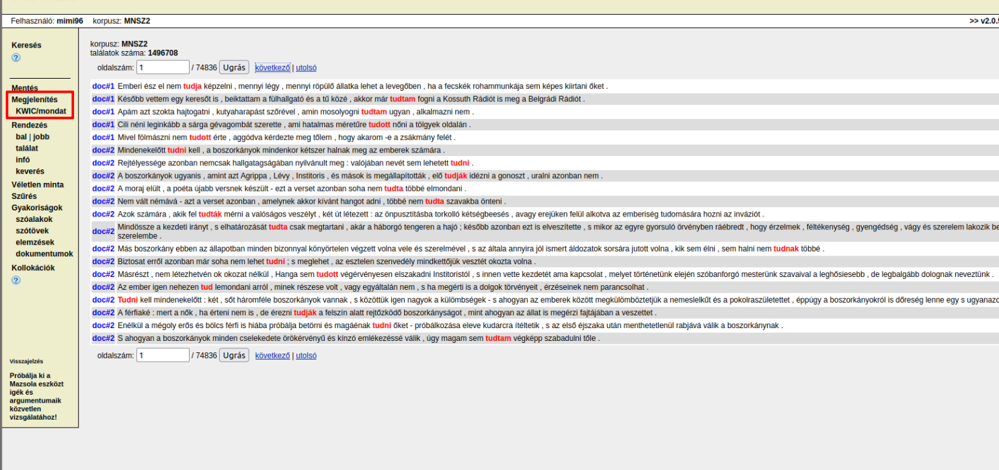

# A (pre)modális szemantikai térrel összekapcsolódó főnévi igeneves szerkezetek vizsgálata
A jelen kutatás a segédige + főnévi igeneves szerkezetek megvalósulási környezeteit hivatott elemezni korpuszalapon, számítógépes vizsgálati eljárásokkal. Az adatokból látható mintázat-együttállásokból elméleti hipotézisek felállításával kapcsolódik ahhoz a kutatási kérdéshez, hogy a vizsgált premodális (lehetségességi relációt nem explikáló) jelentéssel asszociálódó főnévi igeneves kompozitumszerkezetek milyen nyelvi, konstrukcionális kidolgozottságban képesek átlépni a jelentésképzés során a modális szemantikai térbe. A mintavételezés az MNSZ2-ből (Oravecz–Váradi–Sass 2014) és a Webcorpusból valósult meg két lépcsőben. Az első mintavétel során egy reprezentatív (a korpusz méretéhez viszonyítva) elemszámú csoportot vételeztem, a másodiknál pedig törekedtem a keresési kondíciók által kiadott összes elem mentésére. Ezen utóbbi eljárás nem minden esetben tudott megvalósulni, ekkor a lehető legnagyobb konkordancia kinyerése volt a cél. Ugyan a korpuszok által felkínált részletes keresési metódusok nagyon kedvezőnek tűnnek, azonban a legprecízebb mintavételezési módnak a cql kifejezéssel történő szűrés bizonyult.

## Minták a korpuszokból
### Minta az MNSZ2-ből (v2.0.5)
1. ***tud*** + inf. (a minta mérete: 500) / ***tud*** + inf. (a minta mérete: 675000) | teljes minta: 1315296
2. ***akar*** + inf. (a minta mérete: 384) / ***akar*** + inf. (a minta mérete: 610836) | teljes minta: 610836
3. ***szeret*** + inf. (a minta mérete: 384) / ***szeret*** + inf. (a minta mérete: 484448) | teljes minta: 484448
4. ***kíván*** + inf. (a minta mérete: 384) / ***kíván*** + inf. (a minta mérete: 192678) | teljes minta: 192678
5. ***képes*** + inf. (a minta mérete: 384) / ***képes*** + inf. (a minta mérete: 134843) | teljes minta: 134843
6. ***mer*** + inf. (a minta mérete: 382) / ***mer*** + inf. (a minta mérete: 63729) | teljes minta: 63729
7. ***képtelen*** + inf. (a minta mérete: 381) / ***képtelen*** + inf. (a minta mérete: 48036) | teljes minta: 48036
8. ***hajlandó*** + inf. (a minta mérete: 381) / ***hajlandó*** + inf. (a minta mérete: 48267) | teljes minta: 48267
9. ***bír*** + inf. (a minta mérete: 379) / ***bír*** + inf. (a minta mérete: 22191) | teljes minta: 22191
10. ***-kOzik|-kOdik*** + inf. (a minta mérete: 382) / ***-kOzik|-kOdik*** + inf. (a minta mérete: 255799) | teljes minta: 255799
11. ***gyűlöl*** + inf. (a minta mérete: 132) / ***gyűlöl*** + inf. (a minta mérete: 132) | teljes minta: 188
12. ***hajlamos*** + inf. (a minta mérete: 357) / ***hajlamos*** + inf. (a minta mérete: 4212) | teljes minta: 4212
13. ***óhajt*** + inf. (a minta mérete: 361) / ***óhajt*** + inf. (a minta mérete: 5500) | teljes minta: 5500
14. ***remél*** + inf. (a minta mérete: 364) / ***remél*** + inf. (a minta mérete: 6506) | teljes minta: 6506
15. ***utál*** + inf. (a minta mérete: 306) / ***utál*** + inf. (a minta mérete: 1448) | teljes minta: 1448
16. ***vágyik*** + inf. (a minta mérete: 313) / ***vágyik*** + inf. (a minta mérete: 1658) | teljes minta: 1658

`(meet [lemma="akar" & msd="(IK\.)*IGE\.(_HAT\.)?[TI]?[MPF]?[et]?[123]?"] [msd="(IK\.)*IGE\.INF[123]?\*?"] -2 2)`

`(meet [lemma="képes" & msd="MN.PL*.NOM"] [msd="(IK\.)*IGE\.INF[123]?\*?"] -2 2)`

http://clara.nytud.hu/mnsz2-dev/

### Minta a Webcorpus 2.0.-ből
1. ***tud*** + inf. (a minta mérete: 500)
2. ***akar*** + inf. (a minta mérete: 500)
3. ***szeret*** + inf. (a minta mérete: 384)
4. ***kíván*** + inf. (a minta mérete: 384)
5. ***képes*** + inf. (a minta mérete: 384)
6. ***mer*** + inf. (a minta mérete: 381)
7. ***képtelen*** + inf. (a minta mérete: 377)
8. ***hajlandó*** + inf. (a minta mérete: 379)
9. ***bír*** + inf. (sample size: 379)
10. ***szándékozik*** + inf. (sample size: 357)

-   Query word: `[tag="\[/V\]\[Inf\]"]`
-   Positive filter -2 2 1 `[lemma_lc="akar"]`
-   https://elte-dh.hu/sketchengine/
-   https://sketchengine.elte-dh.hu/

## Útmutató a korpuszokból való mintavételhez
### Minta az MNSZ2-ből (v2.0.5)
1. Az első lépésben állítsuk be az MNSZ2 felületén (http://clara.nytud.hu/mnsz2-dev/) az általunk elvégezni kívánt keresés feltételeit. Ennél a lépésnél törekedjünk arra, hogy úgy adjuk meg a keresési paramétereket, hogy azt lefuttatva a számunkra lehető legoptimálisabb mintát adja a keresett nyelvi szerkezet példányaiból. A példában bemutatott keresést a főnévi igenevekre indítottuk, tehát a szófajnál kiválasztottuk a főnévi igenév címkét. 

2. Ha lefuttattuk a keresést, akkor a bal menüsávban kattintsunk a **KWIC/mondat** ikonra. Ez a funkció a találatainkat pontosan egy mondatból álló kontextusban fogja megjeleníteni. 

3. Ezután célszerű ellenőrizni a megjelenítési beállításokat. Ezt a **Megjelenítés** menüpontra kattintva tudjuk megtenni. A beállításoknál a következőkre figyeljünk: 1. **attribútumok --> word**, 2. **struktúrák --> doc**, 3. **infó --> dokumentumazonosító**. 

4. Ha a fenti pontokban leírt instrukciókat végrehajtottuk, akkor lépjünk vissza a konkordanciára. A baloldalon látható menüből válasszuk a **Véletlen minta** ikont. Itt megadhatjuk azt, hogy a konkordanciánkból hány elemű mintát szeretnénk vételezni. Ha a teljes konkordanciával szeretnénk dolgozni, akkor természetesen ezt a lépést hagyjuk ki. 

5. Navigáljunk vissza a konkordanciára, majd válasszuk ki a menüből a **Konkordancia mentése** opciót. A formátumot állítsuk át **XML**-re. Ha a konkordanciánk több, mint 1000 elemet tartalmaz, akkor állítsuk át a sorok számát a megfelelő mennyiségre a minta méretéhez igazodva. 

### Minta a Webcorpus 2.0-ből
1. Hasonlóan az MNSZ2-ből végzett mintavételezéshez, legelőször itt is a keresési céljainkhoz megfelelő paramétereket állítsuk be a lekérdező felületen. 

(A képen a főnévi igenevekre való CQL-lel történő keresés látható) 

2. A keresés lefuttatása után ellenőrizzük a felső menüsávban a megjelenítést. A pontosan egy mondatnyi megjelenítéshez válasszuk ki a **sentence** opciót. 

3. A következő lépésben válasszuk ki a **View options**-t (szem ikon). Itt az alábbi beállítások lesznek relevánsak: 1. **words**, 2. **For KWIC Only**, 3. **Use glue** kikapcsolása. 

4. A **Get a random sample** (kérdőjeles dobókocka ikon) kiválasztásával tudjuk beállítani a mintavétel méretét (ha a teljes konkordanciával szeretnénk dolgozni, akkor ezt a lépést hagyjuk ki). 

5. Végül kattintsunk a **Download**-ra (lefelé mutató nyíl). Kattintsunk az **XML** gombra. 

